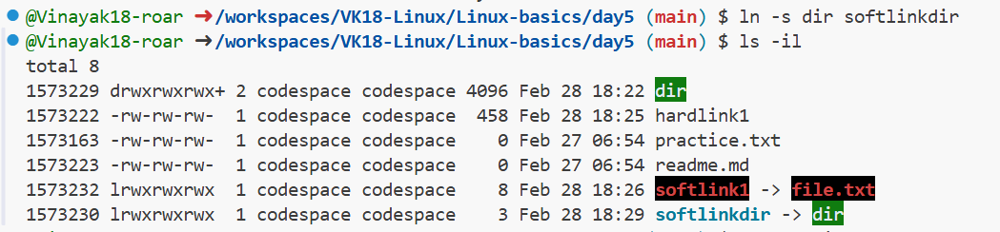
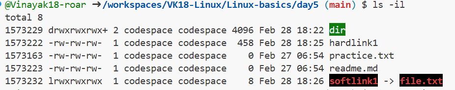
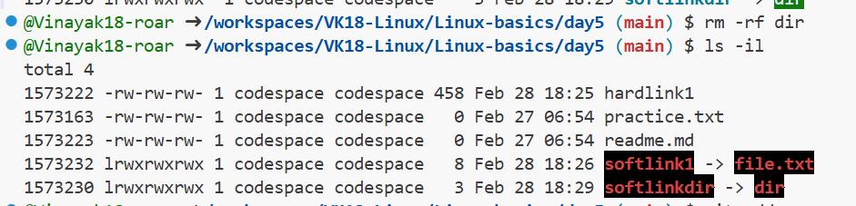

## INODE

Every file on a Linux system has an **inode** which is also referred
to as **index node**

- An inode is basically a file structure. It's a database which contains all of a file information except two things , **namely file contents** and **file name**.

- Typically an inode contains the following information about a
file

(1) Inode number
(2) File size
(3) File type
(4) Owner
(5) Permissions
(6) Number of Links

- Let's say we have a file called file.txt, If you want to view the inode
number of file.txt

Then you just type **ls i file.txt**

- And so typing **ls i** will show allthe inode numbers in your current directory

### Example:

@Vinayak18-roar ➜ /workspaces/VK18-Linux/Linux-basics/day5 (main) $ ls -il

1573229 drwxrwxrwx+ 2 codespace codespace 4096 Feb 28 18:22 dir

1573222 -rw-rw-rw-  2 codespace codespace    0 Feb 28 18:22 file.txt

### Below we created file and folder and checked inode
@Vinayak18-roar ➜ /workspaces/VK18-Linux/Linux-basics/day5 (main) $ ls

practice.txt  readme.md

@Vinayak18-roar ➜ /workspaces/VK18-Linux/Linux-basics/day5 (main) $ touch file.txt

@Vinayak18-roar ➜ /workspaces/VK18-Linux/Linux-basics/day5 (main) $ mkdir dir

@Vinayak18-roar ➜ /workspaces/VK18-Linux/Linux-basics/day5 (main) $ ls

dir  file.txt  practice.txt  readme.md

@Vinayak18-roar ➜ /workspaces/VK18-Linux/Linux-basics/day5 (main) $ ls -i

1573229 dir  1573222 file.txt  1573163 practice.txt  1573223 readme.md
--

## HARD LINK  & SOFT LINK

There are two kinds of Links in Linux, namely Hard and Soft Links.

## Hard link

They are just another name of the same exact file.

- You can create a hard link using **ln** command. Here is the general format of the ln command 

### Syntax:
**ln option Originalfile Linkname**

### Example:
- Now if you want to create a hard link named hard1 for file.

you just type:

**ln file1 hard1**

- Now you should know three things about hardlinks:

(1) They have the same inode number as the original file

(2) They have the exact same file size as the original file

(3) If you delete the original file, hard links will not get affected.
- It's like cloning :D

- Imagine we have a student called peter and a clone of peter called david.
Now if peter died , nothing will happen to david.
Such a sad story.

### We practiced below commands on hardlink

- file.txt : original file, hardlink1: name for link

@Vinayak18-roar ➜ /workspaces/VK18-Linux/Linux-basics/day5 (main) $ ln file.txt hardlink1

@Vinayak18-roar ➜ /workspaces/VK18-Linux/Linux-basics/day5 (main) $ ls

dir  file.txt  hardlink1  practice.txt  readme.md

- Here File size, inode, permisssion of original file (file.txt) and hard link all same only name is change.

@Vinayak18-roar ➜ /workspaces/VK18-Linux/Linux-basics/day5 (main) $ ls -il

total 4
1573229 drwxrwxrwx+ 2 codespace codespace 4096 Feb 28 18:22 dir
1573222 -rw-rw-rw-  2 codespace codespace    0 Feb 28 18:22 file.txt
1573222 -rw-rw-rw-  2 codespace codespace    0 Feb 28 18:22 hardlink1
1573163 -rw-rw-rw-  1 codespace codespace    0 Feb 27 06:54 practice.txt
1573223 -rw-rw-rw-  1 codespace codespace    0 Feb 27 06:54 readme.md

- Here we store some contents in **file.txt** so, file size increase to 458 bytes for both original and link file:

@Vinayak18-roar ➜ /workspaces/VK18-Linux/Linux-basics/day5 (main) $ ls -il

total 12
1573229 drwxrwxrwx+ 2 codespace codespace 4096 Feb 28 18:22 dir
1573222 -rw-rw-rw-  2 codespace codespace  458 Feb 28 18:25 file.txt
1573222 -rw-rw-rw-  2 codespace codespace  458 Feb 28 18:25 hardlink1
1573163 -rw-rw-rw-  1 codespace codespace    0 Feb 27 06:54 practice.txt
1573223 -rw-rw-rw-  1 codespace codespace    0 Feb 27 06:54 readme.md

Note: Hardlink is not allowed for **FOLDERS**

- If you try hardlink on folder (dir):

@Vinayak18-roar ➜ /workspaces/VK18-Linux/Linux-basics/day5 (main) $ ln dir hardlinkdir

ln: dir: hard link not allowed for directory.

----

## SOFT LINK

A soft link is simply a pointer to another file. (Just like shortcut in windows)

To create a soft link we use the **-s** option

### Syntax
**ln -s originalfile linknsme**

- Now if you want to create a soft link named soft1 for file.txt

you just type:

**ln -s file.txt soft1**

- Now you should know three things about hardlinks

(1) They have different inode number with reference to the original
file
(2) They have a smaller file size with reference to the original file
(3) If you delete the original file, soft links will becom useless.

- If you point to something that is not there, then you are crazy.

### Examples: 

@Vinayak18-roar ➜ /workspaces/VK18-Linux/Linux-basics/day5 (main) $ ln -s file.txt softlink1

@Vinayak18-roar ➜ /workspaces/VK18-Linux/Linux-basics/day5 (main) $ ls -il

total 12
1573229 drwxrwxrwx+ 2 codespace codespace 4096 Feb 28 18:22 dir
1573222 -rw-rw-rw-  2 codespace codespace  458 Feb 28 18:25 file.txt
1573222 -rw-rw-rw-  2 codespace codespace  458 Feb 28 18:25 hardlink1
1573163 -rw-rw-rw-  1 codespace codespace    0 Feb 27 06:54 practice.txt
1573223 -rw-rw-rw-  1 codespace codespace    0 Feb 27 06:54 readme.md
1573232 lrwxrwxrwx  1 codespace codespace    8 Feb 28 18:26 softlink1 -> file.txt

## Soft link on folders

- Soflink on folder -dir and it's small in size compare to orginal and inode number is not same.

@Vinayak18-roar ➜ /workspaces/VK18-Linux/Linux-basics/day5 (main) $ ln -s dir softlinkdir

@Vinayak18-roar ➜ /workspaces/VK18-Linux/Linux-basics/day5 (main) $ ls -il

total 8
1573229 drwxrwxrwx+ 2 codespace codespace 4096 Feb 28 18:22 dir
1573222 -rw-rw-rw-  1 codespace codespace  458 Feb 28 18:25 hardlink1
1573163 -rw-rw-rw-  1 codespace codespace    0 Feb 27 06:54 practice.txt
1573223 -rw-rw-rw-  1 codespace codespace    0 Feb 27 06:54 readme.md
1573232 lrwxrwxrwx  1 codespace codespace    8 Feb 28 18:26 softlink1 -> file.txt
1573230 lrwxrwxrwx  1 codespace codespace    3 Feb 28 18:29 softlinkdir -> dir

Refer image- 

## NOTE:

- As we already mentioned, if we delete orginal file then softlink become useless and hardlink will remain same.(Check below).

Here i'm deleting the file.txt:

@Vinayak18-roar ➜ /workspaces/VK18-Linux/Linux-basics/day5 (main) $ rm -rf file.txt

@Vinayak18-roar ➜ /workspaces/VK18-Linux/Linux-basics/day5 (main) $ ls

dir  hardlink1  practice.txt  readme.md  softlink1

@Vinayak18-roar ➜ /workspaces/VK18-Linux/Linux-basics/day5 (main) $ ls -il

total 8
1573229 drwxrwxrwx+ 2 codespace codespace 4096 Feb 28 18:22 dir
1573222 -rw-rw-rw-  1 codespace codespace  458 Feb 28 18:25 hardlink1
1573163 -rw-rw-rw-  1 codespace codespace    0 Feb 27 06:54 practice.txt
1573223 -rw-rw-rw-  1 codespace codespace    0 Feb 27 06:54 readme.md
1573232 lrwxrwxrwx  1 codespace codespace    8 Feb 28 18:26 softlink1 -> file.txt

## removed both orginal file(file.txt) and folder(dir).

